# GoatTracker 2 · GTK Edition

A modern Linux front end for **GoatTracker 2**, Lasse Öörni's tracker-style music editor for the Commodore 64's SID chip. It keeps everything that makes GoatTracker GoatTracker: the playroutine, reSID emulation, packer/relocator, file formats and every keyboard command. The full-screen 1990s text interface is replaced by a docked, resizable GTK4/libadwaita window in the tradition of trackers from FastTracker 2 to Renoise.

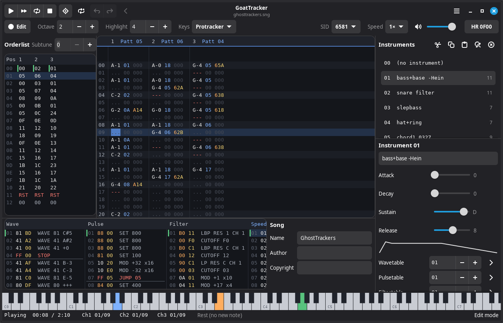

This is an unofficial port of GoatTracker v2.77. The engine and song data are unchanged, so songs, instruments and packed output work interchangeably with the original.

## Before and after

| GoatTracker 2.77 | GTK Edition |
| --- | --- |
| 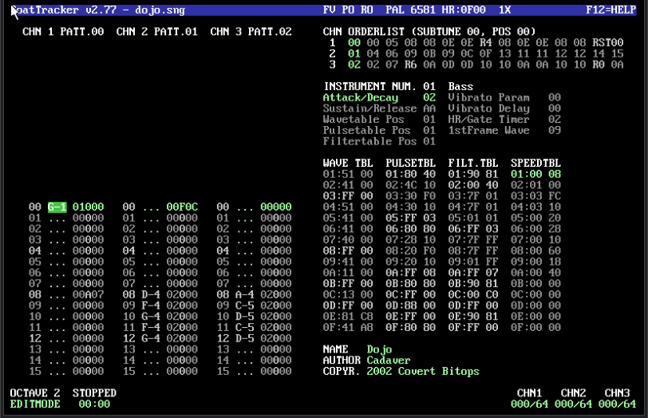 |  |
| One fixed 100×37 character screen drawn with an 8×16 bitmap font, scaled only in whole steps | A resizable window with movable dividers between panels and a scalable monospace font |
| Everything driven by the keyboard, with a few mouse hot spots | Every key command still works, plus native buttons, menus, sliders and fields; click, drag to select and right-click in the grids |
| No undo | Undo and redo for every edit |
| No record of unsaved changes: loading a song replaces your work without a warning | Unsaved changes are tracked, and you are asked before anything is lost |
| A home-made text-mode file selector | The desktop's file chooser |
| Packer options chosen with cursor keys on a text screen | A settings dialog with a report of the packed sizes |
| Help is a text screen scrolled with the cursor keys | A help window with headed sections, scrolled with the mouse or keyboard |
| Hearing a song outside the editor means packing it and playing it elsewhere | WAV export, with optional per-channel stems |
| Jam mode plays one note at a time | Polyphonic jam across the three channels, plus MIDI input |
| SDL 1.2 (no longer maintained) | GTK4, libadwaita and SDL2 audio |

## What's new

### A tracker layout you can see all at once

Orderlists on the left, patterns in the middle, instruments down the right, the wave, pulse, filter and speed tables along the bottom, and a piano keyboard showing what each channel is playing, all visible together and all live while the song plays. Panels are separated by draggable dividers.

All three grid editors work with the mouse:

- Click to place the cursor, drag to select rows, and Shift+click to extend the selection.
- Right-click for the editor's commands: cut, copy and paste, transpose, insert and delete rows, split and join patterns, set the play start and end positions, and more. These are the classic Shift+key commands, so they act on the selection when there is one.
- Double-click an orderlist entry to open that pattern.
- The scroll wheel moves the view without moving the cursor; any key brings the view back to the cursor.

#### Pattern editor

The edit row stays centred while the song scrolls past it, in the style of Renoise and Impulse Tracker. Notes, instruments, commands and their data each have their own colour, and empty fields can be shown as dots. The highlight step is adjustable, and the row each channel is playing is tinted green.

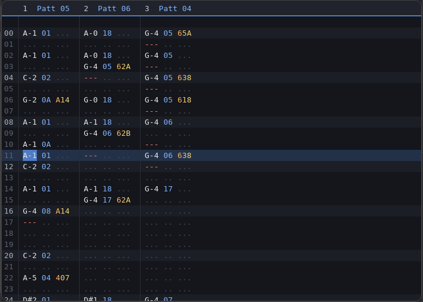

Marked blocks (Shift+cursor keys) are shaded, and clicking a channel header mutes it.

**Shift+Y** glides from the note at the cursor to the next note in the channel, an idea from [GoatTracker Ultra](https://github.com/jpage8580/GTUltra). It works out the portamento speed that arrives in time, puts it in a free speedtable row, writes `1XY`/`2XY` on the rows in between and ties the target note with `300`. The tempo is taken from the last `Fxx` above the cursor in that pattern.

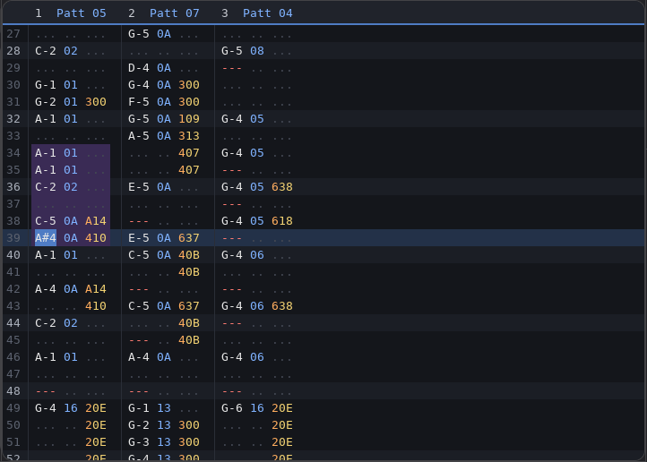

#### Vertical orderlists

The three per-channel orderlists now run top to bottom like a sequencer, so the cursor keys move the way they look: up and down between positions, left and right between digits and channels. Transposes and repeats are coloured, and green and red bars mark the F2 play start and end positions.

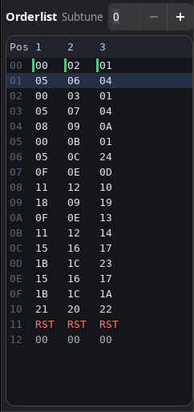

#### All four tables side by side

Table commands and jumps are coloured, and a green bar marks where the selected instrument's pointer starts in each table.

- **Rows are described** next to their hex values: `WAVE 41 +0`, `DELAY 3`, `SET 800`, `MOD +32 x16`, `LP RES C CH 1`, `JUMP 05`. **View → Describe Table Rows** turns the column off; in a narrow window the tables scroll sideways instead.
- **Rows nothing can reach are dimmed.** The editor follows every instrument's table pointers, the table commands in the patterns and the wavetable's own commands, so leftover data stands out. A line under each jump or stop shows where a run of rows ends.
- **Edit Waveform…** in the wavetable's right-click menu sets a row's waveform with buttons for noise, pulse, saw, triangle, test, ring, sync and gate. The pencil next to the instrument's **1st frame wave** does the same.
- **Go back:** after RETURN takes you from a pattern command or instrument to its table data (or from a note to its instrument), **Alt+Left** or the arrow in the header bar returns you to where you were.

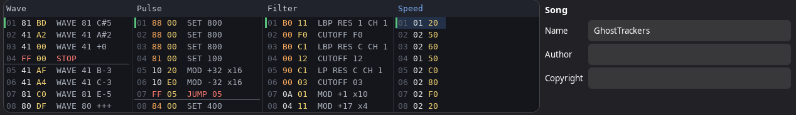

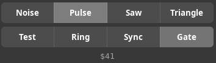

### A native instrument editor

The instrument list sits above an editor for the selected instrument:

- Attack, decay, sustain and release are sliders, with a live drawing of the envelope. The mouse wheel scrolls the editor rather than changing the value under the pointer.
- Each table pointer is a hex field with a button that jumps to that table data.
- The less obvious parameters (gate timer flags, first-frame waveform) have tooltips explaining them.
- **Test Note** plays the instrument for as long as you hold it.
- Buttons for cut, copy, paste, "paste and remap" and delete sit alongside the classic Shift+X/C/V/S/Del keys.

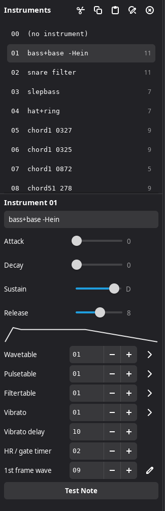

Song name, author and copyright are ordinary text fields. Accented characters are converted to and from the Latin-1 the song format stores.

### Undo and redo

GoatTracker 2 never had undo. Now every change can be undone, with **Ctrl+Z** and **Ctrl+Shift+Z** / **Ctrl+Y** or the arrows in the header bar. That covers note entry, orderlist and table edits, instrument edits, pasting, transposing, merging, loading an instrument, and even Optimize and Clear.

- Undo returns the cursor to where the edit happened.
- Typing a name or dragging a slider counts as one step.
- Up to 500 steps are kept.

### Never lose unsaved work

The title bar shows **•** while the song has unsaved changes. The bullet disappears again if you undo back to the saved state.

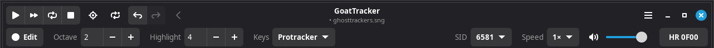

Closing the window, quitting or opening another song asks first, and **Save…** saves and then carries on with what you were doing.

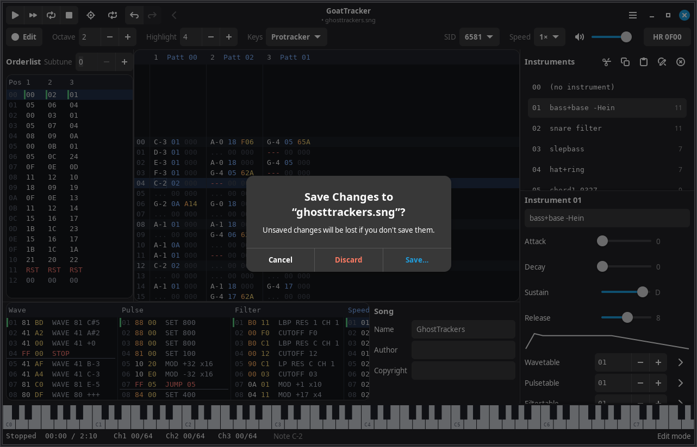

### Saving, backups and safety

- **Ctrl+S** saves over the current file from anywhere; **Save Song As…** (F11) asks for a name.
- **Automatic backups**: every 30 seconds a changed song is copied to `~/.goattrk/backups/`, with a timestamp in the name. The newest 20 per song are kept. The interval is set in Preferences, which also has a button to open the folder.
- **Damaged files are refused safely.** The stock loader trusts every length in a `.sng` file, so a truncated file, or a 6-channel song from GoatTracker Stereo or Ultra, could crash it. Files are now checked first and the current song is left untouched.
- **Drag and drop** a `.sng` onto the window to open it, or an `.ins` to load it into the current instrument.
- **Merging** tells you when the song runs out of subtunes, instruments, table rows or patterns part way, instead of stopping silently. Ctrl+Z undoes the partial merge.

### Settings that travel with the song

Songs are saved with the editor-settings block that [GoatTracker Ultra](https://github.com/jpage8580/GTUltra) introduced: SID model, PAL/NTSC, speed multiplier, hard-restart ADSR and the playroutine optimisations. Opening the song restores them, here or in GoatTracker Ultra. The block is appended after the normal song data, which stock GoatTracker 2 ignores, so files stay compatible. GoatTracker Ultra's per-instrument pan values and SIDTracker64-mode flag are kept when you save, and you're warned that a SIDTracker64-mode song will sound different here.

### Preferences

The settings that used to be command-line options or hand edits to `goattrk2.cfg` are in **Preferences** (Ctrl+,): buffer length, mixing rate, SID emulation and interpolation, PAL/NTSC timing, HardSID and CatWeasel, and the playroutine optimisations. It also has the settings new to this edition: volume, detune, MIDI input, the backup interval and continuing into the next pattern. `goattrk2.cfg` keeps its stock format; settings of this edition go in `~/.goattrk/gtkedition.ini`.

### WAV export and song length

- **Export WAV…** (Shift+F11) renders the current subtune to a 16-bit WAV file far faster than real time. You can choose how many times through the song, a fade-out, normalisation, and **channel stems**: one file per channel with the others muted, sharing the full mix's normalisation so their levels stay comparable. The stems don't add up exactly to the mix, because the SID's filter and output stage are shared between channels. Exports start without the click the SID's first volume write would otherwise cause.
- The status bar shows the **song length** next to the play time (for example `00:00 / 2:41`). It's measured by a fast silent run of the playroutine, a moment after you stop editing.
- **Export Again** (Ctrl+F9) packs the song again to the last exported file with the same options, without opening the dialog.

### Playback

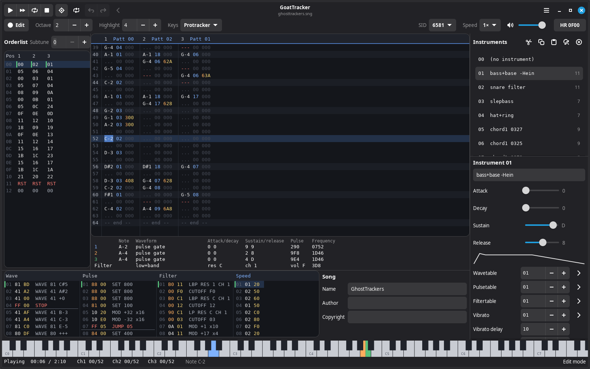

- **Loop** (the repeat button in the header bar, or Playback → Loop): while the song plays, each channel repeats the pattern it is on instead of moving on, so you can work on a passage while it plays. With rows marked in the pattern editor, **Play Pattern** (F3) loops just those rows.
- **Play from Here** (Ctrl+Enter in the orderlist, or its right-click menu) starts at the chosen position with everything as it would be had the song played from the start: tempo, transposes, filter and the song timer. The playroutine runs silently up to that point first, which takes a fraction of a second.
- **Piano keyboard** (View → Piano Keyboard) under the editors shows the note each channel is sounding in its channel colour, following vibrato, portamento and arpeggios. Click a key to hear it with the current instrument.
- **SID registers** (View → SID Registers) under the pattern editor show each voice's note, waveform bits, ADSR, pulse width and frequency, and the filter's type, resonance, routing, volume and cutoff, as the playroutine writes them.
- **Volume** is a slider in the toolbar and in Preferences. It only affects what you hear, not exported WAV files.
- **Detune** in Preferences runs the emulated SID up to a semitone fast or slow, to play along with other instruments. The tempo is unchanged.
- **Polyphonic jam:** in jam mode (Space), note keys in the pattern editor play on whichever channel is free, starting with the cursor's, so you can play chords. Each note stops when its key is released. Muted channels are left alone.
- **MIDI input:** choose a keyboard or other MIDI source under **Preferences → MIDI**. In edit mode its notes are entered at the pattern cursor like typed ones (middle C is C-4); in jam mode they play polyphonically. GoatTracker also appears as an ALSA sequencer client, so other sources can be connected to it with `aconnect` or a patchbay.
- **Continue into the next pattern** in Preferences: moving the cursor past the end of a pattern goes on to the next pattern in that channel's orderlist, and past the start goes back to the previous one.

### Menus, toolbar and status bar

- **Header bar:** transport controls, follow-play, loop, undo/redo, and the arrow that goes back after a jump to table or instrument data.
- **Toolbar:** edit/jam mode, octave, row highlight step, note-entry layout (Protracker, DMC or Janko), SID model, speed multiplier, playback volume and the hard-restart ADSR. These used to be hidden behind Shift+F-key combinations.
- **Status bar:** playback time and song length, each channel's position, and a plain-language description of the item under the cursor. For example, `F0C` reads "Tempo 12 on all channels", and a table row reads "Set pulse width 840".
- **Instrument list:** shows how many patterns use each instrument, and dims unused ones.

| Main menu | View menu |
| --- | --- |
| 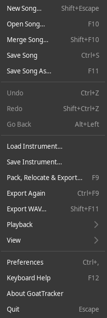 | 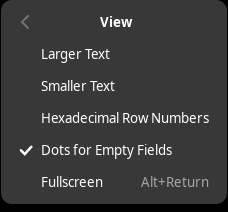 |

The main menu has separate items for opening, merging and saving songs, loading and saving instruments, and exporting, so none of them depend on which editor you are in.

### Pack, relocate and export in a real dialog

The playroutine options are switches that respect their dependencies (sound effects, zeropage ghost registers and full buffering switch on buffered writes for you). The player and zeropage addresses are hex fields, and the output format is a drop-down. After packing you get the size report the command-line packer prints.

| Options | Result |
| --- | --- |
| 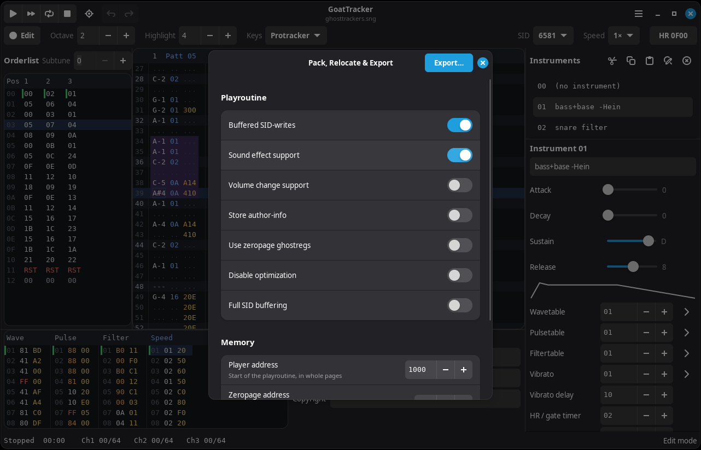 | 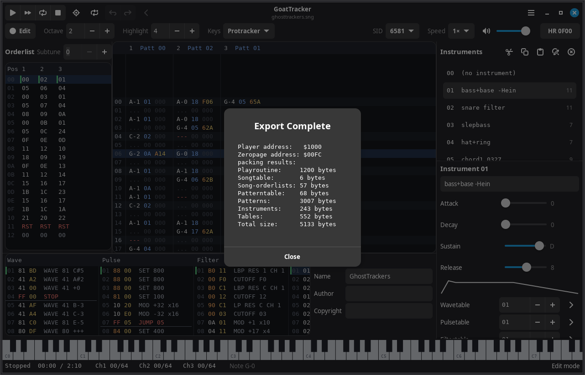 |

Two packing options come from [GoatTracker Ultra](https://github.com/jpage8580/GTUltra). Both are off by default, and the music plays the same either way:

- **Patterns in Play Order** stores the patterns in the order the song first plays them, rather than by pattern number.
- **Zeropage ghostregs to SID**: with zeropage ghost registers, the stock player leaves copying them to the SID to your own code. This option makes the player write them itself at the start of each frame, so the music also plays on its own (in a SID player, for example).

The packer is shared with `gt2reloc`, which produces byte-identical output to the original with these options off. `gt2reloc` takes them as `-Q1` and `-K1`.

### Dialogs instead of y/n prompts

**Shift+Esc** used to ask six yes/no questions in a row. It now opens one dialog where you tick the parts to clear and set the new pattern length.

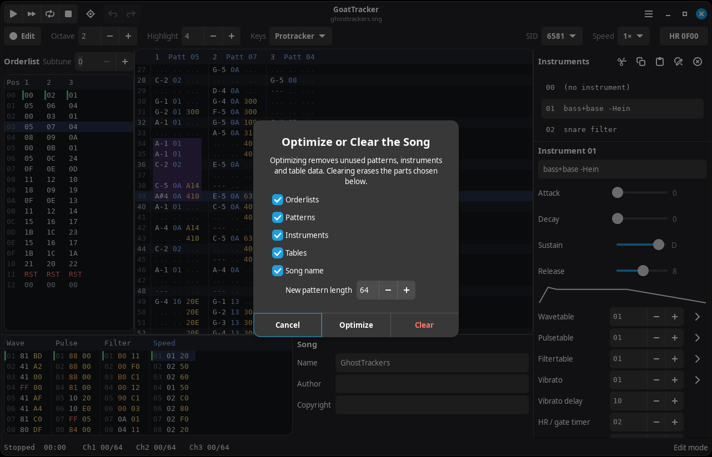

The keyboard reference (**F12**) is a help window; **Shift+F12** puts the current editor's keys first.

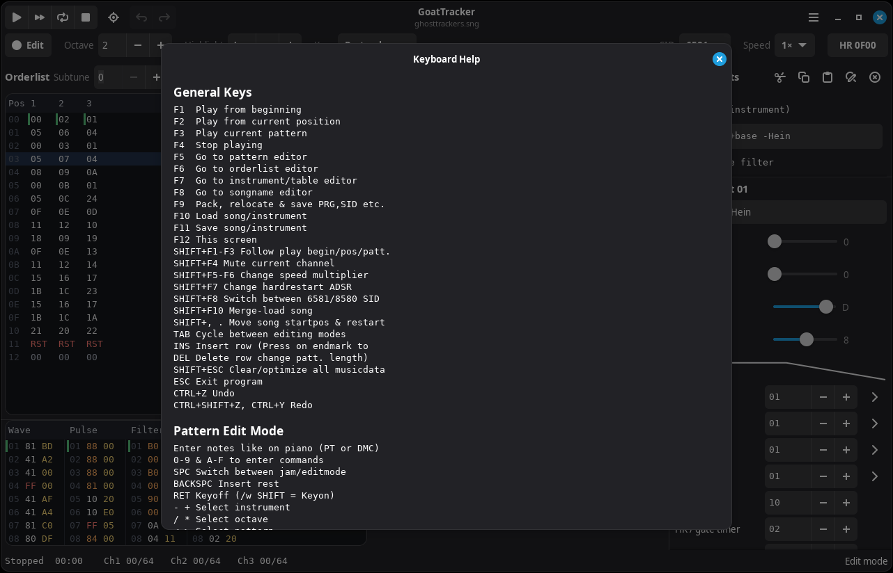

### Bigger text when you want it

The grids use a scalable monospace font. **View → Larger Text** (or `-w2`…`-w4` on the command line) makes the whole window bigger together: the grids, panels, toolbar, menus and dialogs. The window can be any size. The screenshot below is at the third size, the same song as above.

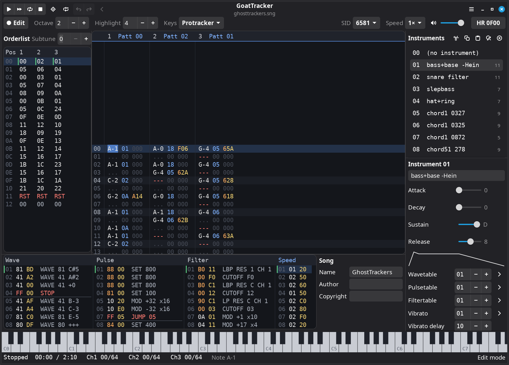

## What stays the same

- **Keyboard:** every key command from the original works, in the editor it belongs to. The full reference is in [readme.txt](readme.txt) section 2.3, or press **F12**. The few differences:
  - Ctrl+Z and Ctrl+Y are undo and redo. Ctrl otherwise still doubles as Shift; Shift+Z still cycles auto-advance.
  - New shortcuts: Ctrl+S saves, Ctrl+, opens Preferences, Ctrl+F9 exports again, Ctrl+Enter in the orderlist plays from that position, Shift+F11 exports a WAV, and Alt+Left goes back. Where the original treated these Ctrl keys as Shift, the Shift versions still do the classic thing; Shift+F11 used to be the same as F11 (save).
  - In jam mode, notes stop when their key is released, and several keys can sound at once.
  - Tab cycles between the editors.
  - Text fields keep their own keys, except the function keys.
- **Files:** `.sng` and `.ins` files keep the stock format, and stock GoatTracker 2 loads songs saved here. The only addition is the editor-settings block at the end of a song (see above), which it ignores. The settings file `~/.goattrk/goattrk2.cfg` is unchanged too.
- **Command line:** the same options as before (`goattrk2 song.sng -s1 -e1` and so on). `-w` now sets the text size, and `-??` opens the help window at startup.
- **Sound:** the same reSID and reSID-fp emulation, and the same playroutine, timing and packer.
- **Tools:** `gt2reloc`, `ins2snd2`, `sngspli2` and `mod2sng` are built alongside the editor and behave as before. `gt2reloc` also accepts the two new packing options, `-Q1` and `-K1`.

## Building

You need a C/C++ compiler, GTK 4.10 or later, libadwaita 1.5 or later, SDL2 and the ALSA library (for MIDI input). On Debian or Ubuntu (24.04 or later):

```sh
sudo apt install build-essential pkg-config libgtk-4-dev libadwaita-1-dev libsdl2-dev libasound2-dev
```

On Fedora:

```sh
sudo dnf install gcc gcc-c++ make pkgconf gtk4-devel libadwaita-devel SDL2-devel alsa-lib-devel
```

Then build and run:

```sh
cd src
make -j
../linux/goattrk2 ../examples/dojo.sng
```

`make install` copies the programs to `/usr/local/bin` and the man page to `/usr/local/man/man1`.

## Not included

- **Other platforms:** the Windows and MorphOS builds have been dropped, and this edition is for Linux.
- **The classic interface:** the original full-screen text screen is gone.
- **Hardware output:** HardSID and Catweasel support is still in the code but hasn't been tested with this edition.

## Credits and licence

GoatTracker 2 is by **Lasse Öörni** (Cadaver, Covert BitOps), with HardSID 4U support by Téli Sándor, the reSID engine by Dag Lem, reSID distortion and nonlinearity by Antti S. Lankila, the 6510 cross-assembler from Exomizer2 by Magnus Lind, and patches by Stefan A. Haubenthal, Valerio Cannone, Raine M. Ekman, Tero Lindeman, Henrik Paulini, Groepaz and Birgit Jauernig. See [readme.txt](readme.txt) for the original documentation and version history.

Distributed under the GNU General Public License; see [copying](copying). The example songs in `examples/` are by their respective authors, as credited in each song.
